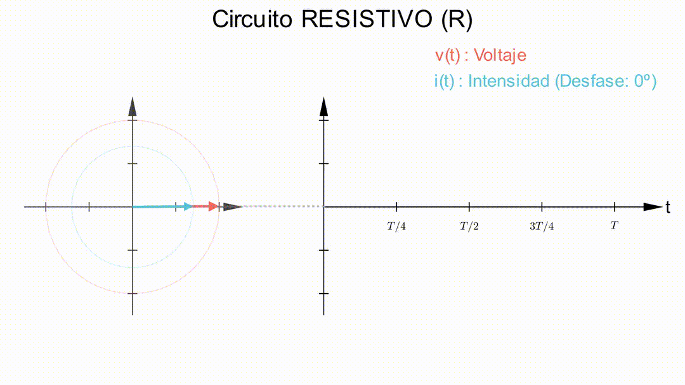
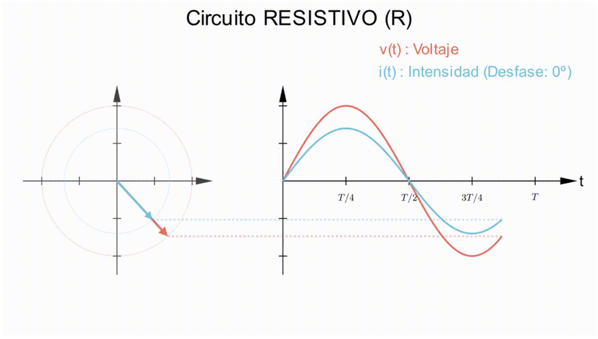
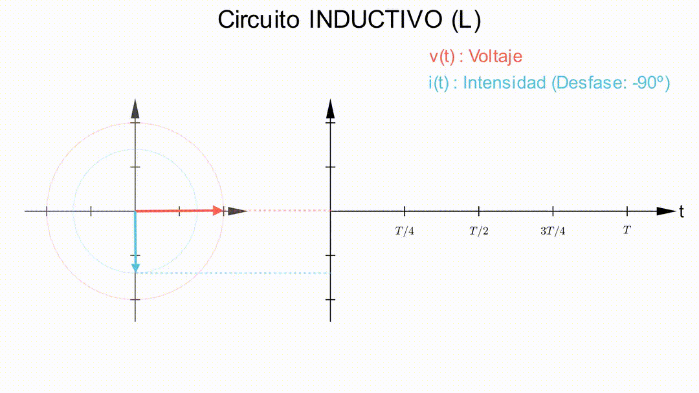
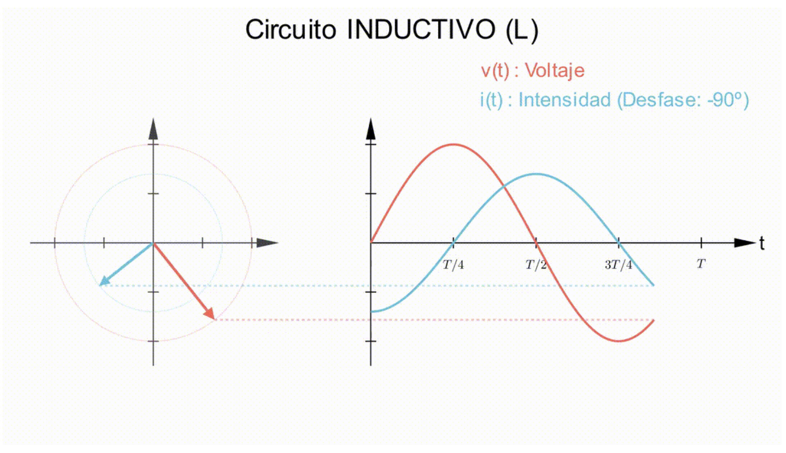
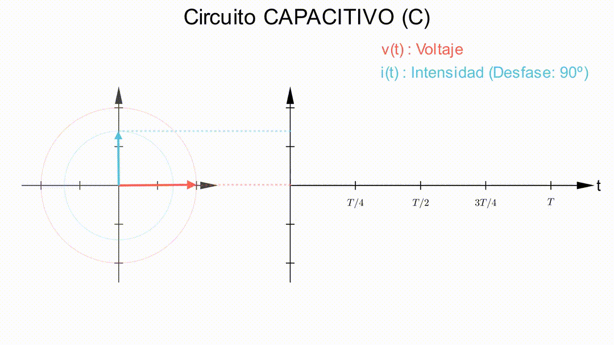
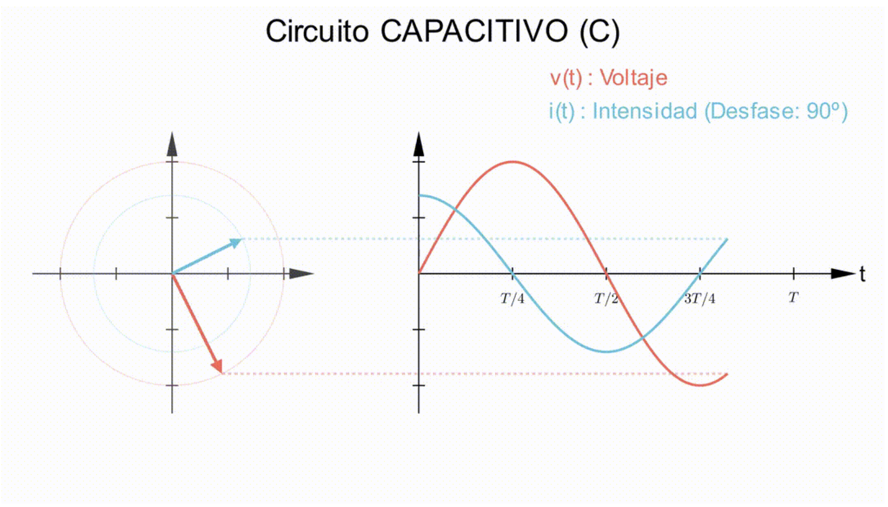
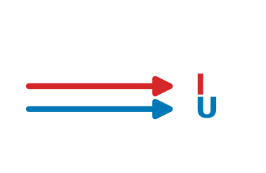
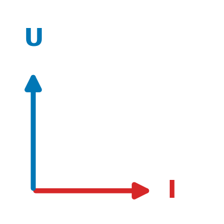
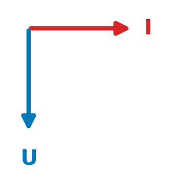
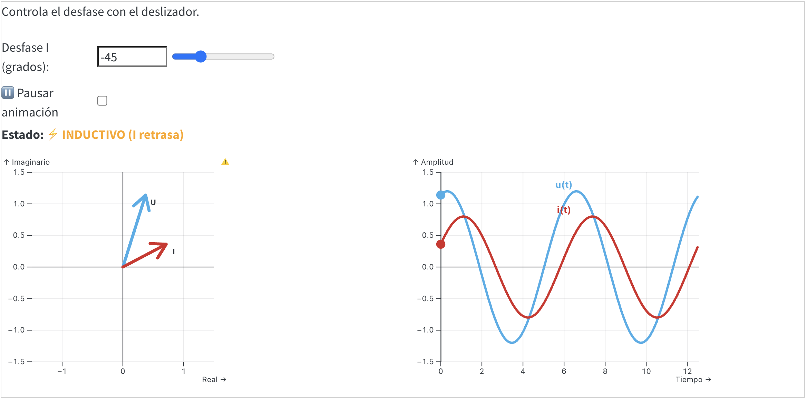

# Respuesta de los componentes básicos a la Corriente Alterna

## Respuesta de una resistencia

Si a una resistencia de valor R ohmios (Ω) se la somete a una tensión sinusoidal de **valor eficaz U** y **pulsación ω**, la tensión instantánea aplicada a la resistencia es: 
$$u(t) = (\sqrt{2} U) \cdot \sen(\omega t + \varphi)$$

Según la ley de Ohm, tenemos que $i(t) = u(t)/R$, y por tanto, la intensidad instantánea que circula por la resistencia es: $$i(t) = \frac{\sqrt{2}U}{R} \cdot \sen(\omega  t + \varphi)$$ Analizando las expresiones de la tensión y la intensidad, podemos concluir que:

-   La intensidad eficaz es $I=\frac{U}{R}$, igual que en corriente continua.
-   El desfase entre la tensión y la intensidad es nulo. Es decir, están en fase ($\varphi_{I}=\varphi$)

La representación gráfica de la tensión y la intensidad en una resistencia eléctrica será, por tanto:

::: {.content-visible when-format="html"}
{fig-align="center" width="90%"}
:::
::: {.content-visible when-format="pdf"}
{fig-align="center" width="90%"}
:::

## Respuesta de una bobina

Si a una bobina de valor **L henrios (H)** se la somete a una intensidad sinusoidal de **valor eficaz U** y **pulsación ω**, la intensidad instantánea que circula por la bobina es:

$$
i(t) = (\sqrt{2}I) \cdot \sen(\omega t + \varphi)
$$

La ley que rige para una bobina es la siguiente:

$$u(t) = L \cdot \frac{di(t)}{dt}$$

Por lo tanto, la tensión instantánea en la bobina la obtenemos derivando la intensidad y resulta ser:

$$u(t) = L \frac{di(t)}{dt} = L \cdot (\sqrt{2}I) \cdot \omega \cdot \sen(\omega  t + \varphi + \frac{\pi}{2})$$

::: {.callout-note style="width:80%;margin:auto"}
## Importante

En realidad, la derivada del seno es el coseno, pero el coseno de un ángulo es igual al seno de su complementario ($\cos(\alpha) = \sen(\alpha + \frac{\pi}{2})$). Por lo tanto, podemos poner la expresión en forma de seno, para poder comparar los fasores de la tensión y la intensidad.
:::

Por consiguiente, obtenemos una tensión con la misma pulsación que la intensidad y con las características siguientes:

-   Un valor de pico $U_p=\omega \cdot L \cdot \sqrt{2} I$. Por lo tanto, **la tensión eficaz es** $U=\omega \cdot L \cdot I$**.**

-   La tensión se encuentra adelantada 90° (\$\\pi/2 \$ ) con respecto a la intensidad; la **fase inicial de la tensión es** $\varphi_U = \varphi + \frac{\pi}{2}$**.**

Al producto $\omega \cdot L$ se le llama **reactancia inductiva** y se representa por $X_L$, es decir:

::: {.callout-caution style="width:150px;margin:auto" appearance="minimal"}
$$
X_L=\omega \cdot L
$$
:::

**La unidad de la reactancia inductiva en el SI es el ohmio (**$\omega$**).**

La representación gráfica de los fasores y ondas de tensión e intensidad en una bobina es la mostrada en la figura:

::: {.content-visible when-format="html"}
{fig-align="center" width="90%"}
:::
::: {.content-visible when-format="pdf"}
{fig-align="center" width="90%"}
:::


## Respuesta de un condensador

Si a un condensador de valor **C faradios (F)** se le somete a una tensión sinusoidal de valor eficaz U y pulsación
co, la tensión instantánea aplicada al condensador es:
$$u(t) = (\sqrt{2} U) \cdot \sen(\omega t + \varphi)$$

Aplicando la ley que rige un condensador, $i(t) = C \cdot du(t) / dt$, la intensidad instantánea que circula por el
condensador es:
$$
i(t) = C \cdot \frac{du(t)}{dt} = C \cdot \omega \cdot ( \sqrt{2}U) \cdot \sen(\omega  t + \varphi + \frac{\pi}{2})
$$

Obtenemos una intensidad con la misma pulsación que la tensión aplicada y con las características siguientes:
- Un valor de pico $I_p=\omega \cdot C \cdot \sqrt{2} U$. Por lo tanto, **la intensidad eficaz es** $I=\omega \cdot C \cdot U$**.**
-   La intensidad se encuentra adelantada 90° (\$\\pi/2 \$ ) con respecto a la tensión; la **fase inicial de la intensidad es** $\varphi_I = \varphi + \frac{\pi}{2}$**.**

Al cociente $1/\omega \cdot C$ se le llama **reactancia capacitiva** y se representa por $X_C$, es decir:

::: {.callout-caution style="width:150px;margin:auto" appearance="minimal"}
$$
X_C=\frac{1}{\omega \cdot C}
$$
:::


**La unidad de la reactancia capacitiva en el SI es el ohmio (**$\omega$**).**


La representación gráfica de los fasores y ondas de tensión e intensidad en un condensador es la mostrada en la figura:

::: {.content-visible when-format="html"}
{fig-align="center" width="90%"}
:::
::: {.content-visible when-format="pdf"}
{fig-align="center" width="90%"}
:::


## Cuadro resumen con las respuestas R, L y C

::: {.tabla-estilo-libro}
| Elemento | Representación gráfica | Relación Tensión/Intensidad | Desfase rad (º) |
| :---: | :---: | :---: | :---: |
| **Resistencia ($R$)** | {width=100px} | $R$ | $0^\circ$ |
| **Bobina ($L$)** | {width=100px} | $X_L = \omega \cdot L$ | $+\pi/2 \ (+90^\circ)$ |
| **Condensador ($C$)** | {width=100px} | $X_C = \frac{1}{\omega \cdot C}$ | $-\pi/2 \ (-90^\circ)$ |

:::


## Combinación de cargas de diferente naturaleza

Por lo general, en un circuito tendremos cargas que ofrecerán diferentes resistencias eléctricas. Además, algunas presentarán también carácter inductivo o capacitivo. Dependiendo de la combinación de elementos que tengamos en cada circuito, el desfase entre la intensidad y la tensión podrá tomar diferentes valores, no solo 0º, -90º o +90º. 
En este simulador puedes ver cómo cambiarían los fasores de la tensión y la intensidad dependiendo de cómo variemos las componentes R, L o C de un circuito:

::::: {.content-visible when-format="html"}

:::: card
Controla el desfase con el deslizador.

```{ojs}
//| echo: false

// --- 1. CONTROLES (Solo deslizador, sin pausa) ---
viewof angulo_i_deg_anim_3 = Inputs.range([-90, 90], {
  value: -45, 
  step: 1, 
  label: "Desfase I (grados):"
})

// --- 2. MOTOR DE TIEMPO (Continuo) ---
now_3 = {
  while (true) {
    yield Date.now();
    await new Promise(resolve => requestAnimationFrame(resolve));
  }
}

// Velocidad de la animación
speed_3 = 0.002 
t_anim_3 = now_3 * speed_3

// --- 3. LÓGICA DE TEXTO ---
md`**Estado:** ${
  angulo_i_deg_anim_3 < 0 ? "<span style='color:orange; font-weight:bold'>⚡ INDUCTIVO (I retrasa)</span>" :
  angulo_i_deg_anim_3 > 0 ? "<span style='color:green; font-weight:bold'>🔋 CAPACITIVO (I adelanta)</span>" :
  "<span style='color:blue; font-weight:bold'>💡 RESISTIVO (En fase)</span>"
}`
```

```{ojs}
//| echo: false

// --- 4. CÁLCULOS MATEMÁTICOS (50 Hz) ---
phi_rad_anim_3 = angulo_i_deg_anim_3 * Math.PI / 180

// Ángulos actuales (Rotación continua de fasores)
ang_u_actual_3 = t_anim_3 
ang_i_actual_3 = t_anim_3 + phi_rad_anim_3

// Coordenadas puntas fasores
u_x_anim_3 = 1.2 * Math.cos(ang_u_actual_3)
u_y_anim_3 = 1.2 * Math.sin(ang_u_actual_3)
i_x_anim_3 = 0.8 * Math.cos(ang_i_actual_3)
i_y_anim_3 = 0.8 * Math.sin(ang_i_actual_3)

// Datos Ondas (Escala temporal real para 50Hz)
// 50Hz = 0.02s periodo. Mostramos 2 periodos (0.04s)
x_domain_3 = d3.range(0, 0.041, 0.0002) 

data_ondas_anim_3 = [
  ...x_domain_3.map(x => ({ 
      t: x, 
      // omega = 2*pi*50
      y: 1.2 * Math.sin(2 * Math.PI * 50 * x + t_anim_3), 
      type: "u(t)", 
      color: "#3daee9" 
  })),
  ...x_domain_3.map(x => ({ 
      t: x, 
      y: 0.8 * Math.sin(2 * Math.PI * 50 * x + t_anim_3 + phi_rad_anim_3), 
      type: "i(t)", 
      color: "#d62728" 
  }))
]

// Líneas de proyección
data_proyeccion_3 = [
  {x1: u_x_anim_3, y1: u_y_anim_3, x2: 2.5, y2: u_y_anim_3, color: "#3daee9"},
  {x1: i_x_anim_3, y1: i_y_anim_3, x2: 2.5, y2: i_y_anim_3, color: "#d62728"}
]
```

::: {layout-ncol="2"}
```{ojs}
//| echo: false
// GRÁFICO 1: FASORES
Plot.plot({
  width: 300,
  height: 300,
  grid: true,
  aspectRatio: 1,
  x: {domain: [-1.5, 1.5], label: "Real"},
  y: {domain: [-1.5, 1.5], label: "Imaginario"},
  marks: [
    Plot.ruleX([0]),
    Plot.ruleY([0]),
    Plot.link(d3.range(0, 2*Math.PI, 0.1).map(a => ({x: 1.2*Math.cos(a), y: 1.2*Math.sin(a)})), {x: "x", y: "y", stroke: "gray", strokeOpacity: 0.2}),
    Plot.link(d3.range(0, 2*Math.PI, 0.1).map(a => ({x: 0.8*Math.cos(a), y: 0.8*Math.sin(a)})), {x: "x", y: "y", stroke: "gray", strokeOpacity: 0.2}),
    
    // Flechas
    Plot.arrow([{x1:0, y1:0, x2:u_x_anim_3, y2:u_y_anim_3}], {x1:"x1", y1:"y1", x2:"x2", y2:"y2", stroke: "#3daee9", strokeWidth: 4}),
    Plot.arrow([{x1:0, y1:0, x2:i_x_anim_3, y2:i_y_anim_3}], {x1:"x1", y1:"y1", x2:"x2", y2:"y2", stroke: "#d62728", strokeWidth: 4}),
    
    // Etiquetas
    Plot.text([{x:u_x_anim_3, y:u_y_anim_3, label:"U"}], {x:"x", y:"y", text:"label", dx: 10, dy:10, fontWeight:"bold"}),
    Plot.text([{x:i_x_anim_3, y:i_y_anim_3, label:"I"}], {x:"x", y:"y", text:"label", dx: 10, dy:10, fontWeight:"bold"}),
    
    // Proyección
    Plot.line(data_proyeccion_3, {x1: "x1", y1: "y1", x2: 1.5, y2: "y2", stroke: "color", strokeDasharray: "4,4", strokeOpacity: 0.5})
  ]
})
```

```{ojs}
//| echo: false
// GRÁFICO 2: ONDAS
Plot.plot({
  width: 400,
  height: 300,
  grid: true,
  // Eje X configurado para mostrar 0.04s (2 ciclos a 50Hz)
  x: {label: "Tiempo (s)", domain: [0, 0.04]},
  y: {domain: [-1.5, 1.5], label: "Amplitud"},
  marks: [
    Plot.ruleY([0]),
    Plot.ruleX([0], {strokeWidth: 2, strokeOpacity: 0.5}),
    Plot.line(data_ondas_anim_3, {x: "t", y: "y", stroke: "color", strokeWidth: 3}),
    
    // Puntos instantáneos
    Plot.dot([{x:0, y:u_y_anim_3}, {x:0, y:i_y_anim_3}], {x:"x", y:"y", fill: ["#3daee9", "#d62728"], r: 6}),
    
    // Etiquetas ajustadas a la nueva escala temporal
    Plot.text([{x: 0.02, y: 1.3, label: "u(t)"}, {x: 0.02, y: 0.9, label: "i(t)"}], {
      x: "x", y: "y", text: "label", fill: ["#3daee9", "#d62728"], fontSize: 12, fontWeight: "bold"
    })
  ]
})
```
:::
::::
:::::

::: {.content-visible when-format="pdf"}
## Simulación Interactiva

Como este documento es estático, no es posible mostrar la simulación interactiva de los fasores giratorios. Puedes acceder a la versión animada haciendo clic en el siguiente enlace:

{width="80%" fig-align="center"}

[**➡️ Ver Simulación Interactiva en la Web**](https://joselugarEducaAnd.github.io/2teci-circuitosCA/03_respuesta_comp.html)
:::