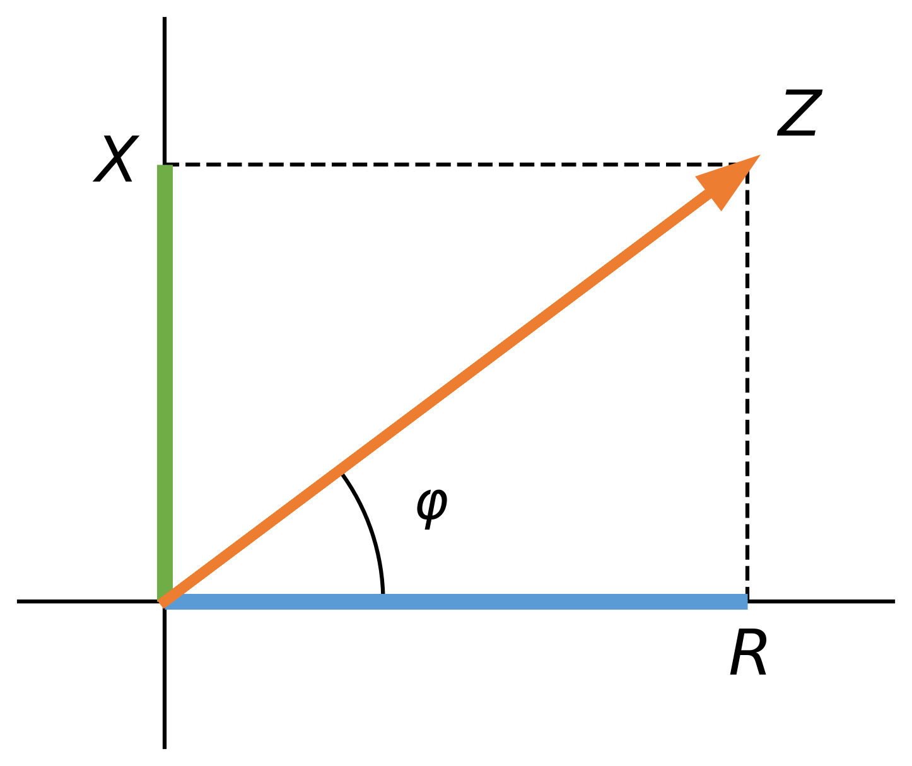

# Impedancia

El concepto de impedancia es una **generalización del concepto de resistencia.** Hemos visto que en CA los elementos conectados en el circuito, en general, introducen un desfase entre la intensidad y la tensión. Este desfase hace que no haya una proporcionalidad entre los valores instantáneos de intensidad y tensión, como ocurría en corriente continua. No se cumple la ley de Ohm, tal y como la conocíamos, con los valores instantáneos $i(t)$ y $v(t)$. Sin embargo, **esta proporcionalidad sí existe entre los fasores**, y también entre los valores máximos $U_0$ e $I_0$, o los valores eficaces $U$, $I$. Esto hace que podamos expresar la ley de Ohm con estos valores.

La magnitud que relaciona los valores máximos (y los eficaces) de tensión e intensidad en un circuito, se denomina impedancia (Z), y se mide en ohmios.

La resistencia eléctrica de un conductor se define como la oposición que ofrece al paso de una corriente eléctrica. Cuando la corriente que atraviesa a un conductor es una corriente sinusoidal, el concepto de resistencia se generaliza a impedancia.

::: {.callout-warning style="width:50%;margin:auto" icon="false"}
## Definición

La **impedancia** de un conductor se define como la **oposición** que ofrece al paso de una corriente eléctrica **sinusoidal**.
:::

La impedancia se representa con la letra **Z**. Consideremos una impedancia Z alimentada por una señal sinusoidal de valor eficaz $U$, fase inicial $\varphi_U$ y pulsación $\omega$, tal como se muestra en la figura:

{width="400px"}

La tensión en la impedancia, que es la de la fuente, representada en forma de fasor es: $$\boldsymbol{U} = \sqrt{2}U \phase \varphi_U$$

La intensidad que circula por la impedancia tiene un valor eficaz $I$ y un desfase $\varphi_I$. Representada en forma de fasor la intensidad es: $$\boldsymbol{I} = \sqrt{2}I \phase \varphi_I$$

El cociente entre el fasor tensión y el fasor intensidad representa la impedancia. Expresado matemáticamente es:

$$
\boldsymbol{Z}=\frac{\boldsymbol{U}}{\boldsymbol{I}}=\frac{\sqrt{2}U \phase \varphi_U}{\sqrt{2}I \phase \varphi_I}=\frac{U}{I}\phase {\varphi_U-\varphi_I}
$$

::: {.callout-note style="width:90%;margin:auto" icon="false"}
## Observación

Una impedancia **no es un fasor**. Una impedancia se puede representar por un **vector**, en este caso expresado en forma polar, que contiene dos términos:

-   El **módulo (**$Z$), que representa el cociente entre la tensión y la intensidad que soporta la impedancia. Las tensiones o intensidades pueden darse en valores eficaces o en valores de pico.
-   El **argumento (**$\varphi$), que representa el **desfase entre el fasor tensión y el fasor intensidad**.
:::

Si dibujamos ese vector, podremos ver gráficamente que la componente horizontal correspondería con la **resistencia** y la vertical con la **reactancia** (si es positiva sería inductiva y si es negativa sería capacitiva) del circuito. Esta representación se denomina "triángulo de impedancias" y tiene este aspecto: 

{fig-align="center" width="400px"}

Viendo esta imagen podemos concluir que:

-   A partir de la impedancia, podemos calcular la resistencia y la reactancia: 
    $$
    R=Z \cdot \cos \varphi
    $$ 
    $$
    X=Z \cdot \sen \varphi
    $$

-   A partir de la resistencia y la reactancia, podemos calcular la impedancia: 
    $$
    |\boldsymbol{Z}|=Z=\sqrt{R^2+X^2}
    $$ 
    $$
    \varphi = \arctan \frac{X}{R}
    $$

## Representación compleja de la impedancia

Teniendo en cuenta que el eje horizontal es el eje real y el eje vertical es el eje imaginario, podemos representar el vector impedancia como un número complejo de la forma: 
$$ 
\boldsymbol{Z} = R + \mathrm{j} \cdot X 
$$

Recordemos que:

-   $R$ **es la resistencia:** se mide en ohmios ($\mathrm{\omega}$) y se puede calcular como $R=Z \cdot \cos \varphi$.
-   $X$ **es la reactancia:** se mide también en ohmios ($\mathrm{\omega}$) y se puede calcular como $R=Z \cdot \sen \varphi$. Según el valor que tome la reactancia, la impedancia puede ser:
    -   **Impedancia inductiva:** cuando $X>0$ y, por lo tanto $\varphi >0$, **la tensión está en avance con respecto a la intensidad.**
    -   **Impedancia capacitiva:** cuando $X<0$ y, por lo tanto, $\varphi <0$, **la tensión está en retraso con respecto a la intensidad** o, lo que lo mismo, la intensidad va por delante de la tensión.

::: {.callout-important style="width:90%;margin:auto"}
## Ejemplo

**Determina el valor de la resistencia y reactancia de una impedancia que está sometida a una tensión de 220 V y por la que circula una intensidad de 10 A. Se sabe que la tensión está adelantada 30º con respecto a la intensidad.**\*\*

*Solución:*

Aplicando la definición de impedancia, tenemos: $$Z = \frac{U}{I} = \frac{220}{10} = 22 \ \Omega$$

Tenemos una parte de la impedancia, pero falta saber qué desfase existe. Este dato nos lo dan con el desfase entre la tensión e intensidad, $\varphi = \varphi_U - \varphi_I$, así $\varphi = 30^\circ$. La impedancia expresada en forma polar es: $$\boldsymbol{Z} = 22 \phase 30^\circ \ \Omega$$

Para obtener $R$ y $X$ hacemos: 
$$
\begin{aligned}
R &= Z \cdot \cos \varphi = 22 \cdot \cos(30^\circ) = 11\sqrt{3} \ \Omega \\
X &= Z \cdot \sen \varphi = 22 \cdot \sen(30^\circ) = 11 \ \Omega
\end{aligned}
\quad \Rightarrow \quad
\boxed{
\begin{aligned}
R &= 11 \cdot \sqrt{3} \ \Omega \\
X &= 11 \ \Omega
\end{aligned}
}
$$

Se trata de una reactancia **inductiva**.
:::

\vspace{1em}    

::: {.callout-warning style="width:400px;margin:auto" icon="false"}
## Importante
La **representación compleja** de las impedancias resistiva, inductiva y capacitiva es la siguiente:

$$
\begin{aligned}
\boldsymbol{Z}_R &= R \\[1ex]
\boldsymbol{Z}_L &= \mathrm{j} \cdot X_L = \mathrm{j} \cdot \omega \cdot L \\[1ex]
\boldsymbol{Z}_C &= -\mathrm{j} \cdot X_C = \frac{-\mathrm{j}}{\omega \cdot C}
\end{aligned}
$$
:::